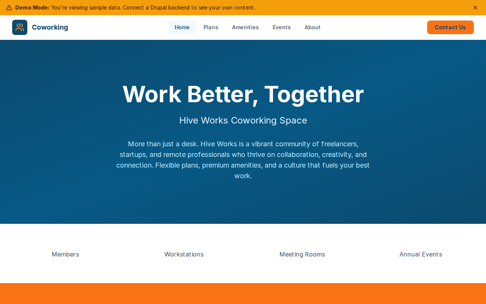

# Decoupled Coworking

A coworking space website starter template for Decoupled Drupal + Next.js. Built for coworking spaces, shared offices, and flexible workspace providers.



## Features

- **Membership Plans** - Showcase hot desk, dedicated desk, and private office plans with pricing
- **Amenities** - Highlight workspace amenities like meeting rooms, kitchen, and event space
- **Community Events** - Promote pitch nights, workshops, happy hours, and networking events
- **Modern Design** - Clean, accessible UI optimized for coworking space content

## Quick Start

### 1. Clone the template

```bash
npx degit nextagencyio/decoupled-coworking my-coworking
cd my-coworking
npm install
```

### 2. Run interactive setup

```bash
npm run setup
```

This interactive script will:
- Authenticate with Decoupled.io (opens browser)
- Create a new Drupal space
- Wait for provisioning (~90 seconds)
- Configure your `.env.local` file
- Import sample content

### 3. Start development

```bash
npm run dev
```

Visit [http://localhost:3000](http://localhost:3000)

---

## Manual Setup

<details>
<summary>Click to expand manual setup steps</summary>

### Authenticate with Decoupled.io

```bash
npx decoupled-cli@latest auth login
```

### Create a Drupal space

```bash
npx decoupled-cli@latest spaces create "My Coworking Space"
```

Note the space ID returned. Wait ~90 seconds for provisioning.

### Configure environment

```bash
npx decoupled-cli@latest spaces env 1234 --write .env.local
```

### Import content

```bash
npm run setup-content
```

This imports:
- Homepage with hero, statistics, and CTAs
- 3 Membership Plans (Hot Desk, Dedicated Desk, Private Office)
- 3 Amenities (Meeting Rooms, Kitchen & Lounge, Event Space)
- 3 Community Events (pitch night, workshop, happy hour)
- 2 Static Pages (About, FAQ)

</details>

## Content Types

### Membership Plan
- **title**: Plan name
- **body**: Plan description
- **price_monthly**: Monthly price
- **includes**: What is included (rich text list)
- **featured**: Featured plan flag
- **ideal_for**: Target audience
- **image**: Plan image

### Amenity
- **title**: Amenity name
- **body**: Amenity description and details
- **amenity_category**: Category (Workspace, Hospitality, Events)
- **availability**: Who can access and how
- **image**: Amenity image

### Community Event
- **title**: Event name
- **body**: Event details
- **event_date**: Start date/time
- **end_date**: End date/time
- **location**: Venue within the space
- **open_to_public**: Whether non-members can attend
- **image**: Event image

## Customization

### Colors & Branding
Edit `tailwind.config.js` to customize colors, fonts, and spacing.

### Content Structure
Modify `data/coworking-content.json` to add or change content types and sample content.

### Components
React components are in `app/components/`. Update them to match your design needs.

## Demo Mode

Demo mode allows you to showcase the application without connecting to a Drupal backend.

### Enable Demo Mode

```bash
NEXT_PUBLIC_DEMO_MODE=true
```

### Removing Demo Mode

1. Delete `lib/demo-mode.ts`
2. Delete `data/mock/` directory
3. Delete `app/components/DemoModeBanner.tsx`
4. Remove `DemoModeBanner` from `app/layout.tsx`
5. Remove demo mode checks from `app/api/graphql/route.ts`

## Deployment

### Vercel (Recommended)
[](https://vercel.com/new/clone?repository-url=https://github.com/nextagencyio/decoupled-coworking)

### Other Platforms
Works with any Node.js hosting platform that supports Next.js.

## Documentation

- [Decoupled.io Docs](https://www.decoupled.io/docs)
- [Next.js Documentation](https://nextjs.org/docs)
- [Drupal GraphQL](https://www.decoupled.io/docs/graphql)

## License

MIT
